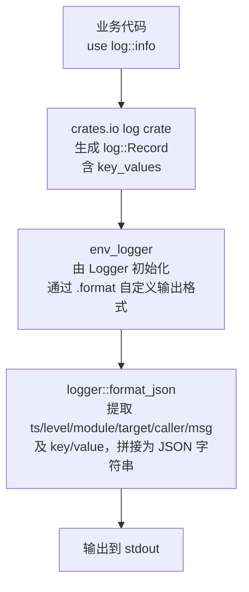

# logger

`logger` 是 Hera 工具链中的日志组件，基于 crates.io 的 [`log`](https://crates.io/crates/log) 与 [`env_logger`](https://crates.io/crates/env_logger) 构建，提供普通文本与 JSON 两种日志输出格式，并支持 `log` 原生的结构化 key/value 语法。

---

## 核心特性

- **直接使用 `log` 原生宏**：业务代码使用 `use log::info;` 即可，无需学习自定义宏。
- **两种输出格式**：
  - 普通文本格式（默认，与 `env_logger` 行为一致）。
  - JSON 结构化格式（通过 `with_json()` 启用）。
- **key/value 支持**：完整支持 `log` 的 `info!(key = value; "msg")` 语法，自动输出为 JSON 字段。
- **caller 行号**：通过 `with_caller_line()` 在普通格式或 JSON 中携带调用行号。
- **自定义 target**：`target: "xxx"` 自定义日志分类标签，自定义 target 会自动输出到 JSON。
- **可配置时间格式**：默认 ISO 8601（`%Y-%m-%dT%H:%M:%SZ`），可通过 `with_time_format()` 自定义。
- **通过 `RUST_LOG` 控制日志级别**：如 `RUST_LOG=info`、`RUST_LOG=my_target=debug`。

---

## 架构设计



### 关键组件

| 组件 | 说明 |
|---|---|
| `Logger` | 初始化入口，负责配置并注册全局 logger。 |
| `format_json` | 将 `log::Record` 格式化为 JSON 字符串。 |
| `JsonVisitor` / `JsonValueVisitor` | 遍历 `log::kv::Source` 与 `log::kv::Value`，将 key/value 转为 `serde_json::Value`。 |
| `pub use log::{debug, error, info, warn}` | 直接暴露 crates.io 的 `log` 宏，保证业务代码零迁移成本。 |

---

## 快速开始

### 1. 添加依赖

在业务项目的 `Cargo.toml` 中：

```toml
[dependencies]
log = { version = "0.4", features = ["kv"] }
logger = { git = "https://github.com/rs-god/hera.git", tag = "v1.2.2" }
```

> `log` 必须启用 `kv` feature，否则 `info!(key = value; "msg")` 语法无法编译。

### 2. 初始化并打印日志

```rust
use log::info;
use logger::Logger;

fn main() {
    Logger::new()
        .with_caller_line()
        .with_json()
        .init();

    info!(a = 1, b = "xxx"; "hello,world");
}
```

运行：

```bash
RUST_LOG=info cargo run
```

输出：

```json
{"ts":"2026-07-18T14:25:16Z","level":"INFO","module":"my_app::main","caller":7,"msg":"hello,world","a":1,"b":"xxx"}
```

---

## Logger 组件核心用法

### 构造 Logger

```rust
use logger::Logger;

let logger = Logger::new();
```

### 链式配置

| 方法 | 说明 | 默认值 |
|---|---|---|
| `with_caller_line()` | 输出中携带调用行号 | `false` |
| `with_json()` | 以 JSON 格式输出 | `false` |
| `with_time_format(fmt)` | 自定义时间格式 | `%Y-%m-%dT%H:%M:%SZ` |

```rust
Logger::new()
    .with_caller_line()
    .with_json()
    .with_time_format("%Y-%m-%d %H:%M:%S")
    .init();
```

### 初始化方法

```rust
// 初始化成功，失败时 panic（推荐在 main 中使用）
logger.init();

// 初始化失败时返回 Result（推荐在测试中使用）
let _ = logger.try_init();
```

### 普通文本格式

```rust
Logger::new().with_caller_line().init();

info!("hello,world");
```

输出：

```text
[2026-07-18T14:25:16Z INFO my_app::main:7] hello,world
```

### JSON 格式

```rust
Logger::new().with_caller_line().with_json().init();

info!(a = 1, b = "xxx"; "hello,world");
```

输出：

```json
{"ts":"2026-07-18T14:25:16Z","level":"INFO","module":"my_app::main","caller":7,"msg":"hello,world","a":1,"b":"xxx"}
```

### 自定义时间格式

```rust
Logger::new()
    .with_json()
    .with_time_format("%Y-%m-%d %H:%M:%S")
    .init();

info!("hello,world");
```

输出：

```json
{"ts":"2026-07-18 14:25:16","level":"INFO","module":"my_app::main","caller":7,"msg":"hello,world"}
```

### 自定义 target

`target` 是 `log` 宏的分类标签，默认等于模块路径。自定义 target 可用于按子系统过滤日志。

```rust
info!(target: "payment", order_id = 12345; "order paid");
```

输出：

```json
{"ts":"2026-07-18T14:25:16Z","level":"INFO","module":"my_app::main","target":"payment","caller":7,"msg":"order paid","order_id":12345}
```

未使用 `target:` 时，JSON 中不输出 `target` 字段：

```rust
info!(order_id = 12345; "order paid");
```

输出：

```json
{"ts":"2026-07-18T14:25:16Z","level":"INFO","module":"my_app::main","caller":7,"msg":"order paid","order_id":12345}
```

### 日志级别过滤

通过环境变量 `RUST_LOG` 控制：

```bash
# 全局 info 级别
RUST_LOG=info cargo run

# 仅 payment target 的 debug 日志
RUST_LOG=payment=debug cargo run

# 多个规则
RUST_LOG=payment=debug,notification=warn,info cargo run
```

---

## pub use 重新导出 log 中的宏

在 `lib.rs` 顶部有：

```rust
pub use log::{debug, error, info, warn};
```

它把 crates.io 的 `log` 宏直接暴露在 `logger` crate 的根命名空间下。这样做有两个目的：

1. **统一入口**：业务项目可以通过 `logger` 同时引入初始化器和宏：

   ```rust
   use logger::{Logger, info};
   ```

2. **零迁移成本**：如果业务项目已经使用 `use log::info;`，仍然可以照常工作，因为两者是同一个宏。

### 两种等价写法

```rust
// 写法 1：直接使用 log crate 的宏
use log::info;

// 写法 2：通过 logger crate 引入（logger 重新导出了 log 的宏）
use logger::info;
```

> 注意：单元测试中使用 `use super::*;` 能访问到这些宏，正是因为它们在 crate 根被 `pub use` 了。

### 为什么不放到单元测试中

如果这行代码只放在 `#[cfg(test)] mod tests` 里，业务项目就无法再写 `use logger::info;`，必须显式依赖 `log` crate。保留在 `lib.rs` 顶部可以让 `logger` 成为日志组件的统一入口，也便于未来在宏层面做扩展时直接替换，而不影响业务代码。

---

## `log` 宏语法参考

本包直接使用 crates.io 的 `log` 宏，支持的写法如下：

```rust
use log::info;

// 纯消息
info!("hello,world");

// 格式化参数
info!("hello, {}", "world");

// key/value（key/value 在前，分号分隔）
info!(a = 1, b = "xxx"; "hello,world");

// 格式化参数 + key/value
info!(a = 1, b = "xxx"; "hello, {}", "world");

// 自定义 target
info!(target: "my_target", "plain message");

// 自定义 target + key/value
info!(target: "my_target", a = 1; "hello,world");
```

> 不支持 `info!("msg", key = value)` 这类非 `log` 原生语法；如需此类写法，需要自行包装宏。

---

## 运行测试

```bash
cd crates/logger

# 运行测试
cargo test -- --nocapture

# 运行 clippy
cargo clippy --all-targets
```

---

## 输出字段说明（JSON）

| 字段 | 类型 | 说明 |
|---|---|---|
| `ts` | string | 日志时间，格式由 `with_time_format()` 决定。 |
| `level` | string | 日志级别：`ERROR` / `WARN` / `INFO` / `DEBUG` / `TRACE`。 |
| `module` | string | 调用宏的 Rust 模块路径。 |
| `target` | string | 可选，仅当通过 `target:` 自定义且与 `module` 不同时输出。 |
| `caller` | number | 可选，仅当启用 `with_caller_line()` 时输出行号。 |
| `msg` | string | 日志消息体。 |
| 自定义 key/value | 多种 | `info!(key = value; "msg")` 中的 key/value。 |
